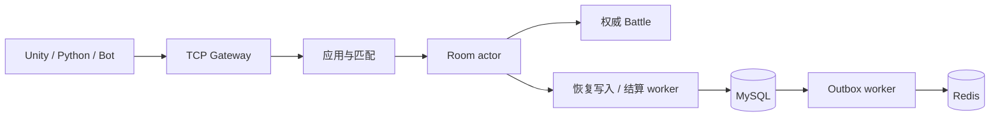
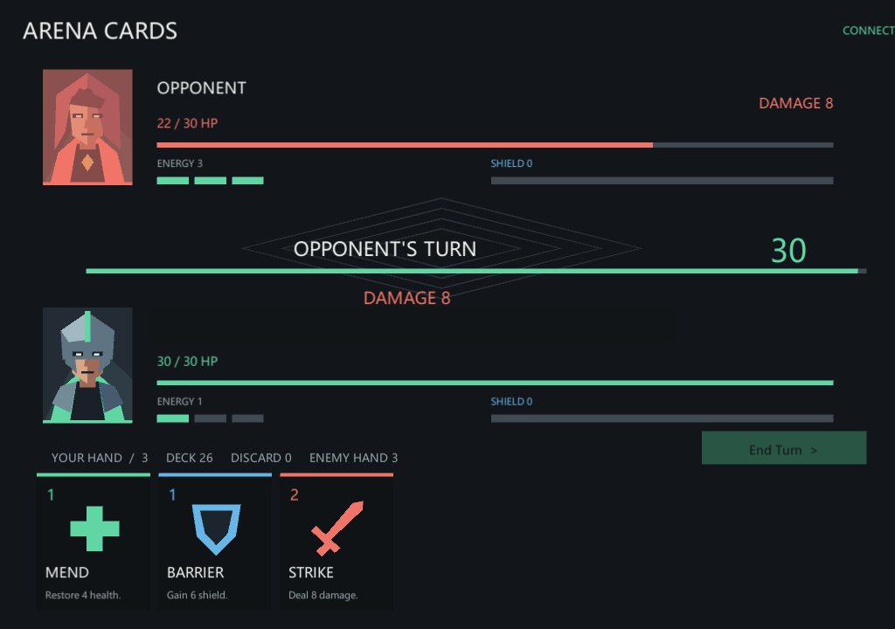

# Arena Cards

C++17 服务端权威的 1v1 回合制卡牌对战项目，配套 Unity/C# UGUI 客户端、Python 调试客户端、自动化 Bot 和 Docker Compose 部署。

客户端只提交操作意图。Room actor 串行执行规则，MySQL 保存权威结果和恢复状态，Redis 维护可重建的排行榜缓存。TextV1 与 ProtoV1 共用 TCP 帧，并支持两种客户端在同一房间对战。

## 启动演示

需要 Docker Desktop 的 Linux engine、Docker Compose 和 Python 3.10+。在仓库根目录执行：

```powershell
python tools/demo/demo.py start
python tools/demo/demo.py check
```

启动入口构建并启动 Arena、MySQL、Redis，检查真实协议和存储状态。默认端口为游戏服务 `9000`、MySQL `3307`、Redis `6379`。详细依赖、客户端启动、双客户端对局、重启续局和缓存补偿操作见 [演示指南](docs/demo-guide.md)。

Unity 2022.3 LTS 项目的场景生成、依赖安装与构建方式见 [Unity 客户端](client_unity/README.md)。协议调试可直接使用：

```powershell
python -m client_pygame.client --cli --host 127.0.0.1 --port 9000
```

## 核心能力

- **权威规则**：九张代表卡牌覆盖伤害、治疗、护盾、持续状态、确定性弃牌、回合结束触发和有限攻防增强；客户端不决定伤害或胜负。
- **房间单写入**：启动、动作、断线、重连、计时和异步完成进入 FIFO 命令队列；网络发送使用独立 writer 与有界队列。
- **双协议**：TextV1 便于调试，ProtoV1 使用 C++/Python/C# 共用 schema；保留旧消息和客户端兼容。
- **网络约束**：连接准入、每连接消息限流、有效入站心跳、慢客户端背压和有预算的优雅退出。
- **数据一致性**：MySQL 事务结算与 `match_id` 幂等；Outbox 独立重试 Redis Lua，缓存故障不阻塞已提交结果交付。
- **在线恢复**：同库、同规则下单实例重启续局，恢复状态、RNG、原 token、最近 128 ACK、绝对截止时间和待交付结果；COMMIT 成功后才 ACK。
- **回放与诊断**：版本化终局回放、离线状态重建、Admin 协议、FastAPI 本地管理工具，以及可复现性能和故障测试。

## 架构与证据



[架构说明](docs/architecture.md) 描述模块依赖、线程与状态所有权；[设计取舍](docs/design-decisions.md) 解释批量 COMMIT、Redis 补偿和恢复模式选择；[证据索引](docs/evidence-index.md) 连接源码、测试入口与公开结果。

完整检查点 `full` 是默认恢复模式，周期快照＋在线尾部 `tail` 可显式配置。同确认语义、同版本的 42 场对照核对了 2,520 局；尾部减少约 85–86% 的逻辑 payload，但高规模收益未稳定达到预定门槛，因此默认保持 `full`。配置与完整结果见 [在线恢复](docs/room-recovery.md) 和 [策略对照报告](docs/recovery-strategy-report.md)。

规模证据覆盖 20/100/200 Bot（10/50/100 房间）。这些是报告所列环境中的实测，不能直接作为生产容量承诺。线程模型采用每房间一个 actor、每连接 reader/writer，存储 API 仍串行保护；在线恢复使用同库单实例锁，适用边界见 [支持范围](docs/project-status.md)。

## 本地构建与测试

服务端严格使用 C++17。默认启用 ProtoV1；依赖固定版本与生成流程见 [Protobuf 接入](docs/protobuf.md)。

```bash
cmake -S . -B build
cmake --build build
ctest --test-dir build --output-on-failure
./build/arena_server 9000
```

Windows + Visual Studio 2022：

```powershell
cmake -S . -B build-msvc -G "Visual Studio 17 2022" -A x64
cmake --build build-msvc --config Release
ctest --test-dir build-msvc -C Release --output-on-failure
build-msvc\Release\arena_server.exe 9000
```

本地进程默认关闭 MySQL。启用真实存储需要 Connector/C、初始化 `deploy/schema.sql` 并设置数据库环境变量；Compose 已提供对应依赖。Linux ASan/UBSan 入口和检测边界见 [sanitizers.md](docs/sanitizers.md)。

## 目录

| 路径 | 内容 |
| --- | --- |
| `server/` | gateway、app、match、room、battle、persistence、ranking、metrics |
| `proto/` | TextV1 消息 ID、ProtoV1 schema 与生成说明 |
| `client_unity/` | Unity/C# UGUI 客户端 |
| `client_pygame/` | Python CLI/Pygame 调试客户端 |
| `tools/` | Bot、压测、回放、管理、构建与演示工具 |
| `tests/` | C++/Python/C# 单元与隔离集成验证 |
| `deploy/` | Docker、数据库 schema 与部署配置 |
| `docs/` | 使用说明、架构、规则和公开实测证据 |

文档入口见 [docs/README.md](docs/README.md)。Compose 的示例密码仅用于本地环境，外部部署应通过环境变量或 Secret 提供凭据。

## 界面与源码交付



画面来自真实联机彩排；测试身份已遮盖，日志区域已裁剪。完整操作与验证范围见[演示报告](docs/demo-report.md)，源码包和客户端附件发布见[发布说明](docs/publication-guide.md)。
