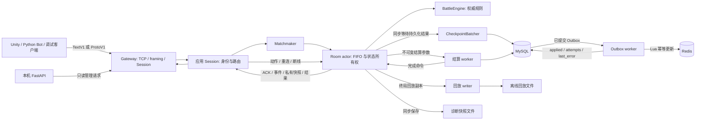
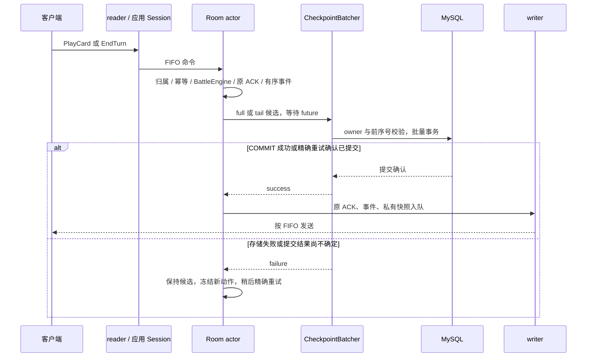
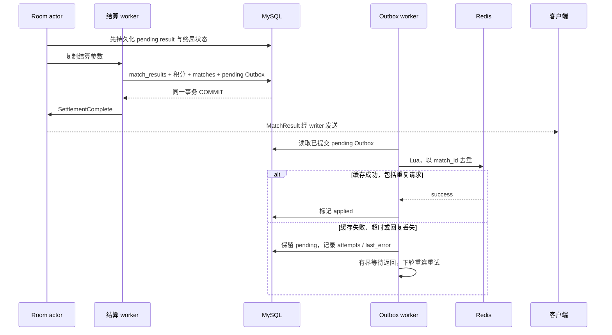
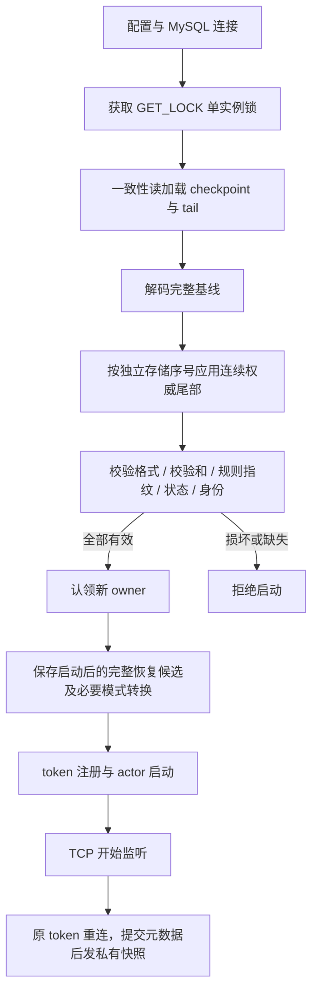

# 架构与状态边界

Arena Cards 是 C++17 权威 1v1 回合制服务端。客户端提交操作意图，服务端决定合法性、规则效果、随机结果和胜负。MySQL 保存权威对局、恢复状态和结算；Redis 保存可重建的排行榜缓存。Unity/C#、Python Bot 与调试客户端只连接游戏 TCP 服务。

箭头表示调用或数据流；图中的 worker 是当前进程内的执行上下文。

## 模块与依赖

| 源码 | 职责 | 关键边界 |
| --- | --- | --- |
| [gateway/](../server/gateway/) | TCP、完整帧、协商、连接准入、限流、心跳、writer 背压 | 通过 `SessionHandler` 回调应用层，不依赖战斗、房间或数据库 |
| [app/session.cpp](../server/app/session.cpp) | 身份、token、房间绑定、业务路由、只读管理和排行榜查询 | 操作意图投递 Room，reader 不修改战斗状态 |
| [match/matchmaker.cpp](../server/match/matchmaker.cpp) | 队列去重、匹配、创建 Room | 不判胜、不结算 |
| [room/room.cpp](../server/room/room.cpp) | FIFO actor、动作幂等、真实计时、重连、恢复及终局编排 | 只有 actor 修改所属房间状态 |
| [room/room_registry.cpp](../server/room/room_registry.cpp) | token 到弱房间引用、玩家槽位的索引 | 锁内只复制索引，重连校验由 actor 完成 |
| [battle/](../server/battle/) | BattleState、BattleEngine、卡牌效果、有序事件和确定性 RNG | 无网络、数据库、线程或真实时钟依赖 |
| [persistence/mysql_store.h](../server/persistence/mysql_store.h) | 事务、幂等、实例锁、连接复用、检查点与 Outbox | 权威存储；API 由共享 mutex 串行保护 |
| [persistence/checkpoint_batcher.h](../server/persistence/checkpoint_batcher.h) | 跨房间恢复写入合并、统一 COMMIT 和完成通知 | Room 保持单写入；批次失败不确认成员 |
| [ranking/redis_leaderboard.h](../server/ranking/redis_leaderboard.h) | 有界网络等待、Lua 幂等缓存更新 | 不决定结算是否成功 |
| [app/runtime.h](../server/app/runtime.h)、[app/shutdown.h](../server/app/shutdown.h) | 显式依赖注入、指标和任务生命周期 | 每个 Runtime 的状态隔离；统一排空与 join |
| [main.cpp](../server/main.cpp) | 配置、存储初始化、恢复、对象构造和退出编排 | 不实现战斗或匹配规则 |

构建边界是 `arena_gateway`、`arena_battle`、`arena_application` 与入口程序。应用层依赖 gateway 接口和纯规则库，底层模块不反向依赖 Room。卡表通过 CardCatalog 加载为共享不可变数据，见 [config/](../server/config/)。

## 线程与生命周期

| 执行上下文 | 当前行为 | 同步或等待 |
| --- | --- | --- |
| 主线程 / accept loop | 启动、accept、心跳巡检、停止准入 | 创建连接后不修改战斗状态 |
| 每连接 reader | 完整帧读取、协商、解码、应用回调 | 应用 Session 保护身份与绑定；Room 操作入 FIFO |
| 每连接 writer | 编码帧 FIFO 写入 | 有界发送队列；Room 不等待 socket |
| 每房间 actor | 规则、幂等、计时、断线、重连、异步完成 | 唯一状态写入者；恢复写入会同步等待 batcher future |
| 单个 checkpoint batcher | 收集跨房间写入、事务提交 | 与结算和 Outbox 共用 MysqlStore mutex |
| 结算 worker | 使用不可变参数尝试 MySQL 事务 | 完成后投递 `SettlementComplete`，不访问 Redis |
| Outbox worker | MySQL 探活、Redis 重连、pending 消费 | Redis 等待期间不持 MysqlStore mutex |
| 回放 writer | 保存终局不可变回放副本 | 完成后投递 `ReplayPersistComplete` |

当前是一连接两个 I/O 工作线程、一房间一个 actor；actor 模型描述状态所有权，不意味着已使用共享执行池。actor 的队列锁只保护投递与取出，战斗状态没有跨线程细粒度锁。Matchmaker、身份绑定与 token 注册表各有自己的互斥边界；指标使用原子计数。

应用 Session 强持有当前 Room，Room 弱引用连接，注册表弱引用 Room；actor 与在途任务在执行期间持有 Room。Matchmaker 队列弱引用 Session，避免强引用环。transport 关闭先设置标志、唤醒 writer 和 shutdown，I/O 退出后才释放 socket，避免旧操作碰到复用后的句柄。旧连接的 Disconnect 只匹配旧 Session，不能清理已接管的新连接。

## 动作：TCP 到 COMMIT 再到 ACK

该持久化保证要求 `ARENA_ROOM_RECOVERY=1`。开启后，建局、动作、断线、重连与期限变化都保存恢复文档，成功动作的 ACK、事件和私有快照在 COMMIT 确认后发布。两种协议进入同一个规则入口。

同一玩家的 `action_id` 查最近 128 个成功回执；参数相同返回原 ACK，参数冲突报错，已淘汰的旧动作仍受高水位约束。收到 ACK 代表已持久化；未收到 ACK 的动作可能已经提交，客户端必须重试原操作及原 `action_id`。ACK 入发送队列不保证客户端已收到。

实现入口：[Session::handle](../server/app/session.cpp)、[Room::apply_action / persist_checkpoint / publish_checkpoint](../server/room/room.cpp)、[BattleEngine::apply](../server/battle/battle_engine.cpp)、[CheckpointBatcher](../server/persistence/checkpoint_batcher.h)。

## 终局：MySQL、Outbox 与结果交付

结算通过 `match_id` 唯一结果与事务内检查消除重复积分；Outbox 与积分同事务提交，进程可在任意位置重启后继续消费。Lua 成功而回复丢失时，重复 `match_id` 不再更新分数。MySQL 失败保持待结算且不发送成功结果；MySQL 成功后结果交付不等待 Redis 恢复。客户端排行榜当前通过服务端只读查询 MySQL，Redis 是可重建缓存。

实现入口：[Room::start_settlement / settlement_complete](../server/room/room.cpp)、[MysqlStore::settle](../server/persistence/mysql_store.h)、[consume_pending_outbox](../server/main.cpp)、[RedisLeaderboard::apply](../server/ranking/redis_leaderboard.h)。

## 启动：快照、连续尾部与 Room 重建

`full` 是默认模式；`tail` 保存权威状态差异、新事件和 ACK/身份/期限/终局元数据，在线 C++ 恢复器逐条应用，**不重新执行客户端命令**。存储序号独立于战斗 revision，metadata-only 写入同样推进序号。新快照与已覆盖尾部删除在同一事务内；未知格式、缺口或校验失败拒绝启动。两种模式保留完整状态/RNG、原 token、128 原 ACK、绝对期限及 pending result。

原已断线玩家保留原绝对截止时间；崩溃前仍连接的玩家在重启后获得 15 秒重连窗口。回合截止时间包含停机时长，不能靠重启重置。终局保留 15 秒结果重取窗口。owner 条件约束写入、删除和结算，防旧实例写入；这支持单实例重启续局，没有路由或自动多实例接管。

实现入口：[main.cpp 启动恢复](../server/main.cpp)、[RecoveryCodec](../server/room/recovery_checkpoint.h)、[RecoveryTailCodec](../server/room/recovery_tail.h)、[Room::restore_checkpoint](../server/room/room.cpp)、[MySQL schema](../deploy/schema.sql)。详见 [room-recovery.md](room-recovery.md)。

## 资源、故障与观测边界

- TCP frame 为 uint32 BE body length、uint16 BE ID 与 payload，body 限制 2–65536 字节。Hello 在登录前协商 TextV1/ProtoV1，新连接重新协商。
- 默认连接上限 512，完整帧限流 200/s、burst 400；发送队列最多 128 帧、256 KiB，超限关闭慢连接。语法完整的入站请求刷新默认 30 秒心跳，慢滴字节不刷新。
- Redis 默认连接预算与单命令 I/O 预算各 1000ms。连接预算包含 DNS 等待及全部地址；I/O 预算包含全部发送及完整回复，部分进展不延长。超时失效连接；阻塞系统 DNS 不可取消，但最多保留一个在途解析任务。
- 检查点默认 batch=16，2ms 收集窗口；队列限制 128 请求/16MiB，批次最多 32 条/1MiB，合法的大文档单独提交。Room 等待批次完成，批次失败保持候选。
- MySQL 池配置 1–8 会话，默认 1。事务和实例锁在锁定会话，允许的 Outbox/只读操作轮换其他槽；共享存储 API 仍串行，池提高复用和失效恢复能力，不代表并行 SQL 吞吐。
- 退出先停准入和匹配，排空连接、Room、结算/回放与 Outbox，最后释放存储。默认全流程 10 秒预算，超预算失败退出。恢复开启时保留对局；关闭恢复时只作废本实例未完成对局，不计分。
- 离线回放与诊断快照用于校验，不是在线恢复入口。FNV 摘要用于一致性/意外损坏检测，不是安全签名或抗篡改认证。
- Admin/FastAPI 面向可信本机管理。进程累计计数重启归零，跨字段读取是近实时观测；`settlement_outbox_pending` 是数据库刷新得到的 gauge。

配置与边界：[network-limits.md](network-limits.md)、[network-lifecycle.md](network-lifecycle.md)、[redis-reliability.md](redis-reliability.md)、[sanitizers.md](sanitizers.md)。

## 客户端与可核对证据

Unity 使用 `ArenaClient` 传输、`ArenaDemoState` 权威消息状态、`ArenaDemoController` 交互门控、`ArenaPresentationView` UGUI 展示。客户端不计算最终伤害、随机结果或胜负，不连接数据库。构建与运行见 [Unity 客户端说明](../client_unity/README.md)。

历史 Unity Editor 编译、画面和 Windows 客户端双协议联机已有验证；交付演示是否复用构建及本次是否运行 Editor，以 [demo-report.md](demo-report.md) 的实际记录为准。历史证据不替代当前彩排。

设计选择见 [design-decisions.md](design-decisions.md)，源码、报告、公开样本与复现入口见 [evidence-index.md](evidence-index.md)。容量结论以对应配置及负载为准；本机 200 Bot 样本不能转换成生产规模承诺。
